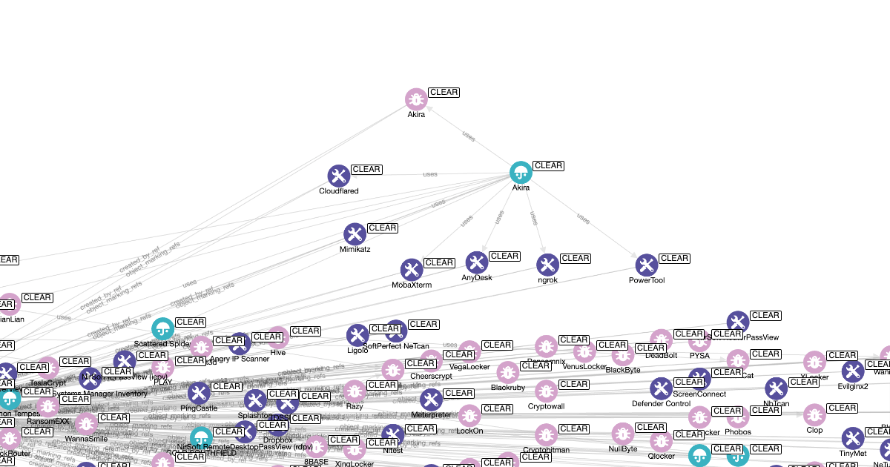

# Ransomware KB

## Overview



Ransomware KB aims to be a centralised knowledgebase, in STIX 2.1 format, that provides a standard for ransomware specific information.

It was born from our frustration of various intelligence producers each naming the same ransomware ever-so-slightly differently.

This project is heavily inspired by MITRE ATT&CK, aiming to fill the gap in MITRE ATT&CK for ransomware specific content. Where relevant, Ransomware KB also links back the MITRE ATT&CK framework with the ultimate goal to commit the data gathered here into MITRE ATT&CK.

The data is managed in the spreadsheet found in this repository here; `data/ransomware_kb_master.xlsx`, with each tab reperesenting a different concept (e.g. `Intrustion Set - Threat Actors`).

## Structure of the data

At present the following concepts are supported;

1. Groups (STIX `intrusion-set` objects, ID in format `GXXXX`): that describe ransomware operators and groups.
2. Ransomware (STIX `malware` objects, ID in format `RXXXX`): that describe the ransomware itself.
3. Tools (STIX `tool` objects, ID in format `TXXXX`): that describe the Tools used by ransomware operators and groups.
4. Victims (TODO): infected by the ransomware
5. Malware (TODO): that describes other malware variants (not ransomware) used by groups during a campaign
6. Linking obejcts to MITRE ATT&CK Tactics and Techniques (TODO)

## Data generation

The script uses the stix2 python library to generate the objects.

A local copy of the objects generated is stored in `stix2_objects`.

### Groups (`intrusion-set`)

These objects are generated from the tab; `Intrustion Set - Groups`;

```json
{
	"type": "intrusion-set",
	"spec_version": "2.1",
	"id": "intrusion-set--<UUIDV5>",
	"created": "<FIRST RUN TIME OF SCRIPT>",
	"modified": "<SCRIPT RUN TIME IF OBJECT CHANGED>",
	"created_by_ref": "identity--221c1248-e62e-56e5-bbfb-7d5efc477271",
	"name": "<name>",
	"description": "<description>",
	"aliases": [
        "<aliases (each new line represents alias>"
    ],
    "external_references": [
        {
           	"source_name": "ranomware-kb",
            "external_id": "<external_id>"
        },
        {
        	"source_name": "mitre-attack",
            "external_id": "<mitre_attack_id>"
        }
        {
            "source_name": "<ref.x>",
        	"description": "<value>"
        }
    ],
    "object_marking_refs": [
        "marking-definition--221c1248-e62e-56e5-bbfb-7d5efc477271",
        "marking-definition--94868c89-83c2-464b-929b-a1a8aa3c8487"
    ]
}
```

The uuidv5 is generated using the namespace `221c1248-e62e-56e5-bbfb-7d5efc477271` and `name` property.

### Ransomware (`malware`)

These objects are generated from the tab; `Malware - Ransomware`;

```json
{
	"type": "malware",
	"spec_version": "2.1",
    "id": "malware--<UUIDV5>",
	"created": "<FIRST RUN TIME OF SCRIPT>",
	"modified": "<SCRIPT RUN TIME IF OBJECT CHANGED>",
	"created_by_ref": "identity--221c1248-e62e-56e5-bbfb-7d5efc477271",
	"name": "<name>",
	"description": "<description>",
	"aliases": [
        "<aliases (each new line represents alias>"
    ],
    "x_mitre_platforms": [
    	"<windows,linux,macos,android>"
    ],
    "external_references": [
        {
           	"source_name": "ranomware-kb",
            "external_id": "<external_id>"
        },
        {
        	"source_name": "mitre-attack",
            "external_id": "<mitre_attack_id>"
        }
        {
            "source_name": "<ref.x>",
        	"description": "<value>"
        }
    ],
    "object_marking_refs": [
        "marking-definition--221c1248-e62e-56e5-bbfb-7d5efc477271",
        "marking-definition--94868c89-83c2-464b-929b-a1a8aa3c8487"
    ]
}
```

The uuidv5 is generated using the namespace `221c1248-e62e-56e5-bbfb-7d5efc477271` and `name` property.

#### Groups (`intrusion-set`) -> Ransomware (`malware`)

The `Intrustion Set - Threat Actors` table has the column `ransomware_used` which contains a key, the `external_id` of the Malware (found in tab `Malware - Ransomware`) to link the two objects. A relationship object is generated to represent this link.

```json
{
	"type": "relationship",
	"spec_version": "2.1",
	"id": "relationship--<UUIDV5>",
	"created": "<CREATED TIME OF MALWARE OBJECT>",
	"modified": "<MODIFIED TIME OF MALWARE OBJECT>",
	"created_by_ref": "identity--221c1248-e62e-56e5-bbfb-7d5efc477271",
	"relationship_type": "uses",
	"source_ref": "intrusion-set--<ID>",
	"target_ref": "malware--<ID>",
	"description": "The group <group.name> uses <malware.name>",
    "object_marking_refs": [
        "marking-definition--221c1248-e62e-56e5-bbfb-7d5efc477271",
        "marking-definition--94868c89-83c2-464b-929b-a1a8aa3c8487"
    ]
}
```

The uuidv5 is generated using the namespace `221c1248-e62e-56e5-bbfb-7d5efc477271` and `<relationship_type>+<source_ref>+<target_ref>` property.

#### Tools (`tool`)

```json
{
	"type": "tool",
	"spec_version": "2.1",
    "id": "tool--<UUIDV5>",
	"created": "<FIRST RUN TIME OF SCRIPT>",
	"modified": "<SCRIPT RUN TIME IF OBJECT CHANGED>",
	"created_by_ref": "identity--221c1248-e62e-56e5-bbfb-7d5efc477271",
	"name": "<name>",
	"description": "<description>",
	"aliases": [
        "<aliases (each new line represents alias>"
    ],
    "x_mitre_platforms": [
    	"<windows,linux,macos,android>"
    ],
    "external_references": [
        {
           	"source_name": "ranomware-kb",
            "external_id": "<external_id>"
        },
        {
        	"source_name": "mitre-attack",
            "external_id": "<mitre_attack_id>"
        }
        {
            "source_name": "<ref.x>",
        	"description": "<value>"
        }
    ],
    "object_marking_refs": [
        "marking-definition--221c1248-e62e-56e5-bbfb-7d5efc477271",
        "marking-definition--94868c89-83c2-464b-929b-a1a8aa3c8487"
    ]
}
```

The uuidv5 is generated using the namespace `221c1248-e62e-56e5-bbfb-7d5efc477271` and `name` property.

`x_mitre_platforms` is determined from columns prefixed with `platform.`. e.g if row has `platform.windows` = `true`, then `x_mitre_platforms` will be populated with `windows`.

`external_references.source_name` cover all properties starting with `ref.`. e.g if column has a value for `ref.cisa` a record will be created as follows;

```json
        {
            "source_name": "cisa",
        	"description": "https://www.cisa.gov/news-evenT/cybersecurity-advisories/aa24-131a"
        }
```

#### Groups (`intrusion-set`) -> Tools (`tool`)

The `Intrustion Set - Threat Actors` table has the column `tools_used` which contains a key, the `external_id` of the Tool (found in tab `Software - Tools`) to link the two objects. A relationship object is generated to represent this link.

```json
{
	"type": "relationship",
	"spec_version": "2.1",
	"id": "relationship--<UUIDV5>",
	"created": "<CREATED TIME OF MALWARE OBJECT>",
	"modified": "<MODIFIED TIME OF MALWARE OBJECT>",
	"created_by_ref": "identity--221c1248-e62e-56e5-bbfb-7d5efc477271",
	"relationship_type": "uses",
	"source_ref": "intrusion-set--<ID>",
	"target_ref": "tool--<ID>",
	"description": "The group <group.name> uses <tool.name>",
    "object_marking_refs": [
        "marking-definition--221c1248-e62e-56e5-bbfb-7d5efc477271",
        "marking-definition--94868c89-83c2-464b-929b-a1a8aa3c8487"
    ]
}
```

The uuidv5 is generated using the namespace `221c1248-e62e-56e5-bbfb-7d5efc477271` and `<relationship_type>+<source_ref>+<target_ref>` property.

### Bundle (`bundle`)

All objects generated each run are stored in a STIX Bundle called `ransomware-kb.json`, as follows;

```json
{
    "type": "bundle",
    "id": "bundle--<UUIDV5>",
    "objects": [
        "ALL STIX OBJECTS CREATED"
    ]
}
```

The UUID is generated using the namespace `221c1248-e62e-56e5-bbfb-7d5efc477271` and the md5 hash of all objects sorted in the bundle.

## Contributing

I welcome all contributions, enhancements, etc. to this work. In fact, without the community, this project will almost certainly die.

To contribute, you can download this code locally

```shell
# clone the latest code
git clone https://github.com/muchdogesec/ransomware_kb
# create a venv
cd ransomware_kb
python3 -m venv ransomware_kb-venv
source ransomware_kb-venv/bin/activate
# install requirements
pip3 install -r requirements.txt
````

And then update the spreadsheet `data/ransomware_kb_master.xlsx`.

When you're done, you can then run the script.

```shell
python3 generate-objects.py
```

You'll find the objects created printed in the `stix2_objects` directory.

If you're ready to contribute, you can submit a pull request to this repository on Github.

## License

[Apache 2.0](/LICENSE).